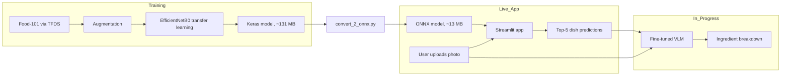

<div align="center">

# 🍽️ FeastAI

**Snap your meal. Skip the typing.**

Photo → dish name → ingredients.

[](LICENSE)


<!-- TODO: add version badge once you tag a release -->
<!-- TODO: add build badge only if you set up CI -->

[**Live Demo**](https://feastvision-gwapvesrky9vmhazuff2oc.streamlit.app/) · [**Docs**](#-how-it-works) · [**Video**](#-proof-of-concept) <!-- TODO: add demo video URL -->


<!-- TODO: record docs/demo.gif -->

Built by [ALOK158](https://github.com/ALOK158) <!-- TODO: add role and one line of ownership, e.g. "solo project: data, training, export, app, VLM prototype" -->

</div>

> **How to read this page:** colored squares (🟦 🟪 🟩 🟧 🟨 🟫 🟥 ⬛ ⬜) mark sections that **click open**. Circles show status: 🟢 Done · 🟡 In progress · 🔵 Planned.

---

## 📑 Table of Contents

- [The Problem](#-the-problem)
- [The Solution](#-the-solution)
- [Proof of Concept](#-proof-of-concept)
- [How It Works](#-how-it-works)
- [Key Features](#-key-features)
- [Progress & Status](#-progress--status)
- [Quick Start](#-quick-start)
- [Roadmap](#-roadmap)
- [Why This Matters](#-why-this-matters)
- [Contributing, License, Contact](#-contributing-license-contact)

---

## 😖 The Problem

> **The habit that makes diet apps work is the one people can't keep.**

Logging meals is the core of most diet apps, and sticking with it is linked to better weight-loss results.[^1] But adherence fades over time.[^1]

<div align="center">

### 2.58%
**of 189,770 users of a free photo-based food-logging app were still actively logging.**[^2]

</div>

| Pain | Why current tools fall short |
|---|---|
| **Effort on every meal.** Search, scroll, pick a portion, up to six times a day.[^3] | Text search and barcode scanning help with packaged food, not a plate of home-cooked or restaurant food. |
| **One food, many names.** *Fries, chips.* *Curd, dahi, yogurt.* | Text search needs the exact term. Fixed-label classifiers (FeastAI's included, at 101 dishes) force a guess. |
| **A name isn't content.** "Pasta" doesn't say what's in it. | Users estimate ingredients by hand, so the log is only as good as their patience. |

**Who feels it:** people who log meals in diet and fitness apps, and the teams building those apps who lose users when logging stops. <!-- TODO: pick ONE beachhead user -->

**Our bet:** if the app does the work after the photo (names the dish, then lists what's in it), logging stops competing with eating. Photo logging alone wasn't enough in the study above, which relied on peer feedback instead of automatic recognition.[^2] <!-- TODO: validate with user interviews or a small pilot -->

**Why now:** vision-language models can reason about what's on a plate instead of only labeling it.

<!-- TODO: add 2-3 named competitors and one verified line on what each gets wrong -->
<!-- TODO: add a sourced market-size figure, or omit -->

---

## 💡 The Solution

FeastAI replaces typing with a photo. An EfficientNet classifier names the dish, and a fine-tuned Vision-Language Model (VLM) breaks that label into likely ingredients.

The classifier is live today and served from a ~13 MB ONNX model. The VLM stage is in development.

| | Typical food logging | FeastAI |
|---|---|---|
| **Input** | Type, search, scroll | Upload a photo |
| **Naming** | Match the app's vocabulary | The image is the query |
| **Result** | A food-database entry | Top-5 dish predictions with confidence 🟢 |
| **Contents** | Manual lookup | Ingredient breakdown from the VLM 🟡 |
| **Nutrition** | Manual lookup | Calories and macros 🔵 |

---

## 🧪 Proof of Concept

**What was built:** an end-to-end ML pipeline, from training through export to a public web app served by ONNX, plus a VLM prototype that adds ingredients.

| Stage | What it demonstrates | Where |
|---|---|---|
| Classifier | Transfer learning with EfficientNetB0 on Food-101 (101 classes) | `FeastAI.ipynb` |
| Export | Keras → ONNX, ~131 MB → ~13 MB | `convert_2_onnx.py` |
| Web app | Upload a photo, get top-5 predictions from the ONNX model | `stream.py`, [live demo](https://feastvision-gwapvesrky9vmhazuff2oc.streamlit.app/) |
| VLM prototype | A fine-tuned VLM, grounded on classifier output, expands a label into ingredients | `Feast_Vision_VLM.ipynb` |

**Evaluation**

| Check | Result |
|---|---|
| Classifier top-1 accuracy | **~85%** <!-- TODO: confirm top-1, and say test vs validation split --> |
| Top-5 accuracy | <!-- TODO: add if measured --> |
| ONNX vs Keras parity | <!-- TODO: run both on the same test set and report the accuracy difference --> |
| Most-confused classes | <!-- TODO: add 3-5 worst classes from a confusion matrix --> |
| CPU inference latency | <!-- TODO: add measured latency --> |
| VLM ingredient quality | <!-- TODO: add eval on a small labeled sample, or real example outputs --> |


<!-- TODO: add a real screenshot -->

---

## ⚙️ How It Works

**In short:** the classifier decides *what dish this is*, running as a small ONNX model so the app doesn't need the full TensorFlow stack. The VLM then answers *what's in it*, using the classifier's label as context.



<details>
<summary>🟦 <b>Engineering decisions and trade-offs</b> <i>(click to expand)</i></summary>

<br>

| Decision | Why | Trade-off |
|---|---|---|
| **EfficientNetB0 backbone** <!-- TODO: confirm B0 vs B1 --> | Strong accuracy for its size | Less capacity than larger variants |
| **Freeze lower layers, fine-tune the top** | Reuses general visual features, needs less data and compute | Less adaptation to food-specific low-level features |
| **Mixed precision training** | Faster convergence | Needs care with numerical stability |
| **Export to ONNX** | ~131 MB → ~13 MB, no TensorFlow at inference | An extra conversion step that needs a parity check |
| **Ground the VLM on the classifier's label** | Anchors the VLM to what the classifier saw instead of guessing from scratch | Classifier mistakes carry into the ingredient list |
| **Streamlit for the app** | Fastest route to a public demo | Not built for production latency or UX control |

</details>

<details>
<summary>🟪 <b>Tech stack and why</b> <i>(click to expand)</i></summary>

<br>

| Tool | Role | Why |
|---|---|---|
| TensorFlow / Keras | Training | Pretrained EfficientNet backbones, mature API |
| Food-101 (TFDS) | Dataset | Standard 101-class food benchmark |
| ONNX + ONNX Runtime | Inference | Small, framework-agnostic, runs on CPU <!-- TODO: confirm runtime and version in stream.py --> |
| Streamlit | Web app | Shareable demo with minimal code |
| Fine-tuned VLM (SFT) | Ingredient breakdown | Turns a label into content <!-- TODO: name base model and training framework --> |

</details>

<details>
<summary>🟩 <b>What this project demonstrates</b> <i>(click to expand)</i></summary>

<br>

- Full ML lifecycle: data pipeline, transfer learning, export, deployment, and a second-stage model
- Practical model optimization: ~10x size reduction with ONNX
- Honest scoping: every feature carries a status, and limitations are listed below

</details>

---

## ✨ Key Features

| Feature | What it does | Status |
|---|---|---|
| Photo-based dish recognition | Replaces typed search with one image (101 dishes, ~85% accuracy) | 🟢 Done |
| Top-5 predictions with confidence | Shows alternatives when the model is unsure | 🟢 Done |
| ONNX inference in the live app | ~13 MB model, no TensorFlow runtime needed | 🟢 Done |
| Public web app | Try it in the browser, no install | 🟢 Done |
| VLM ingredient breakdown | Expands "pasta" into its likely ingredients | 🟡 In progress |
| Calories and macros | Turns ingredients into trackable numbers | 🔵 Planned |
| Multi-dish plates and portions | Logs a full meal from one photo | 🔵 Planned |

---

## 📊 Progress & Status

| Milestone | Status |
|---|---|
| Train EfficientNetB0 on Food-101 with fine-tuning | 🟢 Done |
| Export the model to ONNX | 🟢 Done |
| Build and deploy the Streamlit app, served from ONNX | 🟢 Done |
| Prototype a fine-tuned VLM | 🟢 Done |
| Integrate the VLM into the app | 🟡 In progress |
| Evaluate VLM ingredient quality | 🟡 In progress |
| Nutrition data (calories, macros) | 🔵 Planned |

**Known limitations**

- **101 classes only.** Dishes outside Food-101 get forced into the nearest class.
- **VLM isn't in the live app yet.** The public demo shows classification only.
- **The original Keras model isn't in the repo.** Only the ONNX model is published.
- **No nutrition values yet.** Ingredients come first, numbers later.
- **The core bet is unvalidated.** We haven't tested whether this reduces logging drop-off with real users.

<details>
<summary>🟧 <b>Limitations and responsible use</b> <i>(click to expand)</i></summary>

<br>

- **Estimates, not advice.** Outputs are not medical or dietary guidance, and ~85% accuracy means errors happen.
- **Hidden ingredients.** A photo can't show oil, sugar or sauce contents, so ingredient lists will be incomplete.
- **Uneven coverage.** Accuracy may vary across cuisines and home-style dishes that the training data under-represents.
- **Photo privacy.** <!-- TODO: state whether uploaded images are stored or logged, and how -->

</details>

<details>
<summary>🟨 <b>Reproducibility and quality checklist</b> <i>(click to expand)</i></summary>

<br>

| Item | Status |
|---|---|
| Fixed random seeds and a documented train/validation/test split | 🔵 Planned <!-- TODO: confirm --> |
| Pinned dependency versions in `requirements.txt` | 🔵 Planned |
| A test that checks ONNX output matches the Keras model | 🔵 Planned |
| CI that runs the tests on every push | 🔵 Planned |
| MIT license declared | 🟡 In progress <!-- TODO: add the LICENSE file --> |

</details>

---

## 🚀 Quick Start

**Prerequisites:** Python 3.x, pip, git <!-- TODO: confirm supported Python version -->

```sh
# 1. Clone
git clone https://github.com/ALOK158/Feast_Vision.git
cd Feast_Vision

# 2. Install dependencies
pip install -r requirements.txt

# 3. Run the app
streamlit run stream.py
```

**Usage:** open the local URL Streamlit prints, upload a `.jpg` or `.png` food photo, and read the top-5 predictions with confidence scores.

<!-- TODO: confirm stream.py loads food_classifier_model/food_classifier.onnx from the repo, with no download step -->

<details>
<summary>🟫 <b>Retrain the classifier</b> <i>(click to expand)</i></summary>

<br>

Open `FeastAI.ipynb` in Jupyter or Colab and run all cells. The dataset downloads automatically:

```python
import tensorflow_datasets as tfds
dataset, info = tfds.load("food101", as_supervised=True, with_info=True)
```

</details>

<details>
<summary>🟥 <b>Convert Keras to ONNX</b> <i>(click to expand)</i></summary>

<br>

```sh
python convert_2_onnx.py \
  --model food_classifier_model/food_classifier.keras \
  --output food_classifier_model/food_classifier.onnx
```

</details>

<details>
<summary>⬛ <b>Explore the VLM prototype</b> <i>(click to expand)</i></summary>

<br>

Open `Feast_Vision_VLM.ipynb` in Colab or Jupyter. <!-- TODO: add GPU requirement, base model, and how to run -->

</details>

<details>
<summary>⬜ <b>Repository structure</b> <i>(click to expand)</i></summary>

<br>

```text
Feast_Vision/
├── FeastAI.ipynb               # Classifier training: data, model, training loop
├── Feast_Vision_VLM.ipynb      # VLM fine-tuning prototype
├── stream.py                   # Streamlit inference app (ONNX)
├── convert_2_onnx.py           # Keras → ONNX converter
├── food_classifier_model/
│   └── food_classifier.onnx    # Deployed model (~13 MB)
├── requirements.txt
└── README.md
```

</details>

---

## 🗺️ Roadmap

| Horizon | Item | Benefit | Done when |
|---|---|---|---|
| **Now** (1–2 months) | Integrate the VLM into the app | Users see ingredients, not just a label | Ingredients appear in the live demo |
| **Now** | Publish a full evaluation | Make quality verifiable | The Evaluation table above has no empty rows |
| **Now** | ONNX vs Keras parity test | Back the "lighter, same accuracy" claim | A test in the repo passes in CI |
| **Now** | Small user pilot | Learn if photo-first logging cuts drop-off | At least 5 users interviewed |
| **Next** (3–6 months) | Calories and macros from ingredients | A photo becomes as useful as a manual log entry | A nutrition source is chosen and wired in |
| **Next** | Open-vocabulary recognition | Recognize dishes beyond the 101 classes | Held-out dishes are identified correctly |
| **Next** | Fine-tune on a targeted food domain | Better accuracy where users actually eat | Domain test set beats the baseline |
| **Later** | Multi-dish plates and portion estimation | One photo logs a whole meal | A plate with 2+ dishes is logged in one step |
| **Later** | API or SDK for fitness apps | Let other apps replace typed search | A documented endpoint exists |

<!-- TODO: confirm timelines; these are placeholders -->

---

## 🌍 Why This Matters

Tracking food only works when it's effortless. Every second spent typing and searching is a reason to quit.

FeastAI aims to make logging as fast as taking a photo: any dish, any name for it, with its contents attached.

---

## 🤝 Contributing, License, Contact

- **Contribute:** issues and pull requests are welcome. Open an issue to discuss ideas first.
- **License:** [MIT](LICENSE).
- **Author:** [ALOK158](https://github.com/ALOK158) <!-- TODO: add full name, LinkedIn or email -->

If FeastAI is useful to you, a ⭐ helps others find it.

---

[^1]: Burke et al., dietary self-monitoring research, summarized in [Live Science coverage](https://www.foxnews.com/health/for-tracking-your-diet-smartphones-beat-paper-and-pencil.amp). <!-- TODO: replace with a direct link to the primary paper -->
[^2]: [Factors Related to Sustained Use of a Free Mobile App for Dietary Self-Monitoring With Photography and Peer Feedback](https://doaj.org/article/a1e69d211a424d81bf4418aa50863c97), *JMIR*, 2014. Single app, retrospective cohort, so treat it as an indicator, not a universal rate.
[^3]: [SnappyMeal: Design and Longitudinal Evaluation of a Multimodal AI Food Logging Application](https://arxiv.org/pdf/2511.03907), arXiv, 2025.
